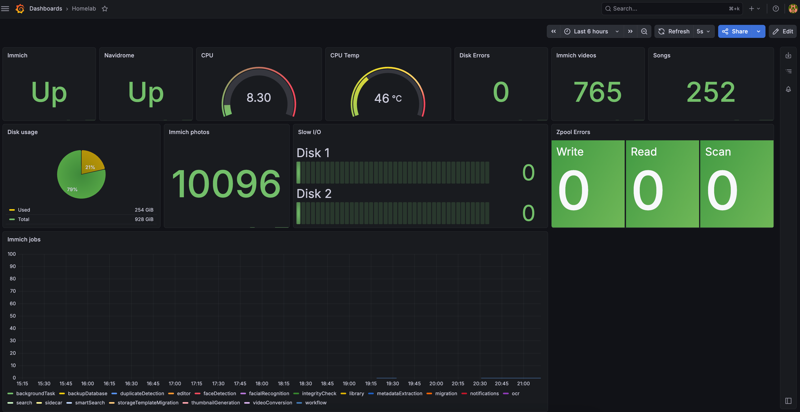

# 🏠 Homelab

Personal self-hosted homelab focused on Linux, DevOps, Infrastructure as Code, monitoring, storage, and self-hosted applications.

## Overview

This homelab serves as a platform to learn and practice:

- Linux Administration
- Containerization
- Ansible Automation
- Monitoring & Observability
- Self-Hosted Applications
- Storage Management (ZFS)
- Networking & Reverse Proxy
- CI/CD & GitOps Concepts

---

# Architecture


## Pf sense router
#### pfSense running on a low-power thin desktop client.


## Automation

### Managed using Ansible:
- Container deployment
- Applications configuration
- Backup jobs
- Monitoring setup
- System updates

## Storage Pool
```text
Pool: tank

tank (1 TB)
└── mirror-0
    ├── disk1 (1 TB)
    └── disk2 (1 TB)

I'm using both disks in mirror mode for data redundancy and fault tolerance


Boot disk Backup Strategy
───────────────────────────────────────────────────────────────────
                     ┌────────────────────┐
                     │   NVME Boot disk   │
                     │      256Gb         │
                     └─────────┬──────────┘
                               │
                               |
                               ▼
                  Oracle HYD periodic Backup
                    Snapshot Sync Cron Job                   
```
- I'm using a shell script to back up the boot disk through btrfs snapshots and store it in Oracle Cloud
- All the backups are retained for 7 days

## Observability Stack
```text

                    ┌───────────────────────┐
                    │     Dell Optiplex     │
                    │  (Prometheus exporter │
                    │      and server)      │
                    └──────────┬────────────┘
                               |
                               │
                               ▼
                     ┌────────────────────┐
                     │      Grafana       │
                     └────────────────────┘
                               │
                               ▼
                     ┌────────────────────┐
                     │    Telegram bot    │
                     │   notifications    │
                     └────────────────────┘

 Grafana dashboard is hosted on the Oracle Hyderabad server, and I'm using my own Prometheus exporter for metrics
```
Collected Metrics:
- Host Metrics
- ZFS Pool Health
- Container Metrics
- Application status
- Storage usage metrics

### Grafana Dashboard


## Learning Goals

This homelab is used to gain hands-on experience with:

- Linux Administration
- Docker
- Ansible
- Terraform
- Prometheus
- Grafana
- Storage configurations
- Networking
- CI/CD
- Kubernetes and more...

## Cost Savings

One of the primary goals of this homelab is reducing dependency on recurring subscription services by self-hosting alternatives.

#### Estimated Annual Savings

```text
Google One               ≈ ₹3,600
Music Subscription       ≈ ₹1,400
Oracle(Always free tier) ≈ ₹0
-----------------------------------
Total Savings            ≈ ₹5,000+/year

